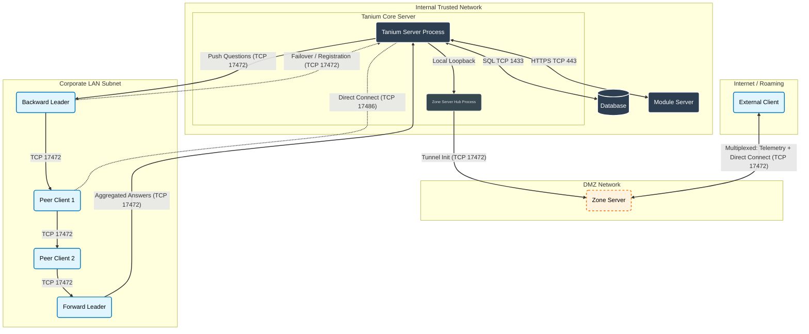

### Tanium Architecture

```mermaid
flowchart TD
    %% Global Styles
    classDef server fill:#2d3e50,stroke:#fff,stroke-width:2px,color:#fff;
    classDef client fill:#e1f5fe,stroke:#0277bd,stroke-width:2px,color:#000;
    classDef dmz fill:#fff3e0,stroke:#ef6c00,stroke-width:2px,stroke-dasharray: 5 5,color:#000;
    classDef subcomponent fill:#37474f,stroke:#fff,stroke-width:1px,color:#ddd,font-size:10px;

    subgraph Core_Network [Internal Trusted Network]
        direction TB
        
        %% Nesting Hub inside Server logic for accuracy
        subgraph TS_Cluster [Tanium Core Server]
            direction TB
            TS(Tanium Server Process):::server
            ZSH(Zone Server Hub Process):::subcomponent
            TS -- "Local Loopback" --> ZSH
        end

        DB[(Database)]:::server
        MS(Module Server):::server
        
        TS <-->|SQL TCP 1433| DB
        TS <-->|HTTPS TCP 443| MS
    end

    subgraph DMZ_Network [DMZ Network]
        ZS(Zone Server):::dmz
    end

    subgraph LAN_Subnet [Corporate LAN Subnet]
        direction LR
        BL(Backward Leader):::client
        P1(Peer Client 1):::client
        P2(Peer Client 2):::client
        FL(Forward Leader):::client
        
        %% Linear Chain
        BL -->|TCP 17472| P1
        P1 -->|TCP 17472| P2
        P2 -->|TCP 17472| FL
    end

    subgraph External_Network [Internet / Roaming]
        EC(External Client):::client
    end

    %% --- PRIMARY TRAFFIC ---
    TS -- "Push Questions (TCP 17472)" --> BL
    FL -- "Aggregated Answers (TCP 17472)" --> TS
    
    %% Failover Logic
    BL -.-> |"Failover / Registration (TCP 17472)"| TS

    %% --- ZONE SERVER TRAFFIC ---
    %% Hub connects OUT to Zone Server
    ZSH -- "Tunnel Init (TCP 17472)" --> ZS
    
    %% MULTIPLEXED TRAFFIC (The Refinement)
    %% Single line representing both telemetry and DC
    EC <==> |"Multiplexed: Telemetry + Direct Connect (TCP 17472)"| ZS
    
    %% --- DIRECT CONNECT (INTERNAL) ---
    %% Internal still uses distinct port
    TS -.- |"Direct Connect (TCP 17486)"| P1

    %% Formatting
    linkStyle default stroke-width:2px,fill:none,stroke:333;
```
