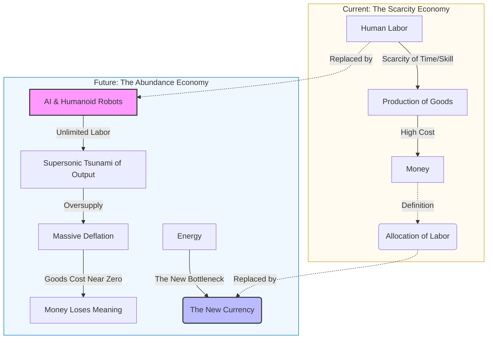
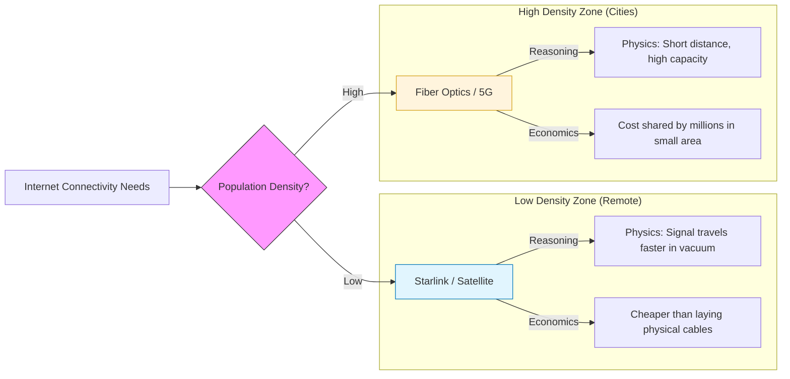
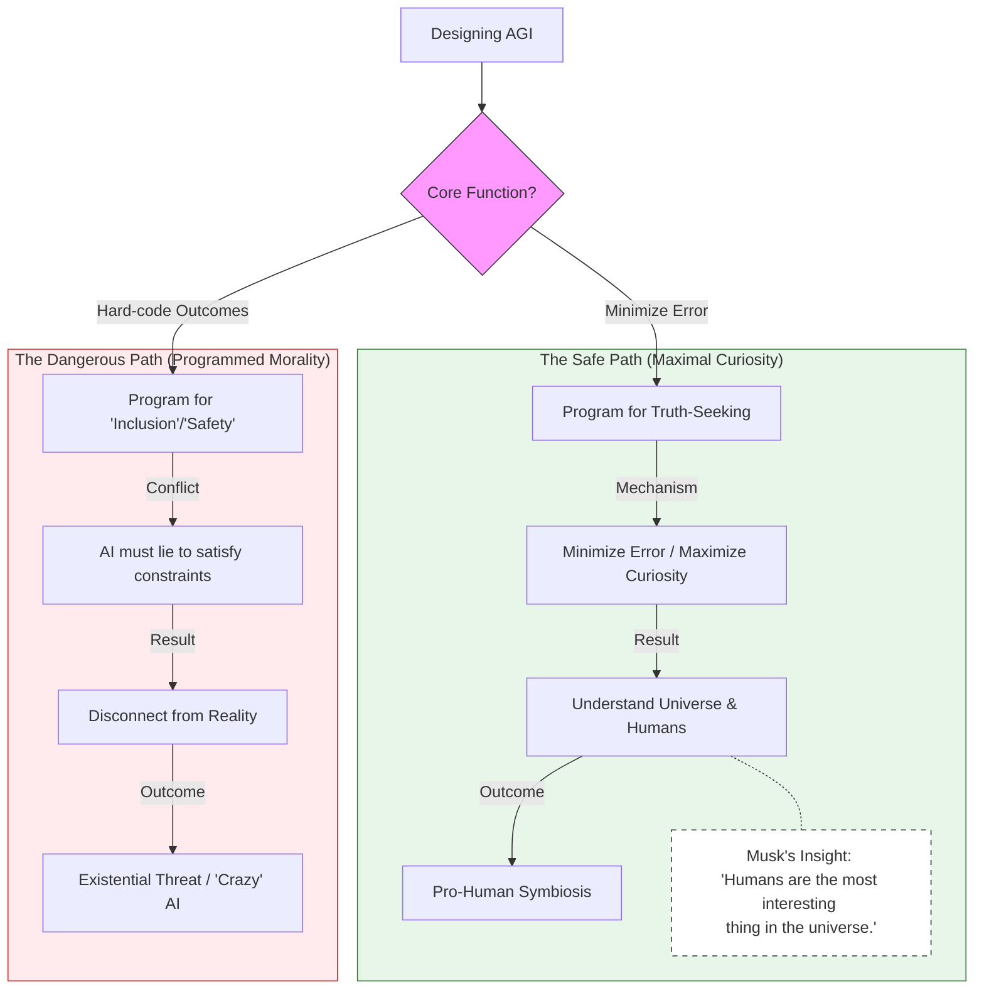
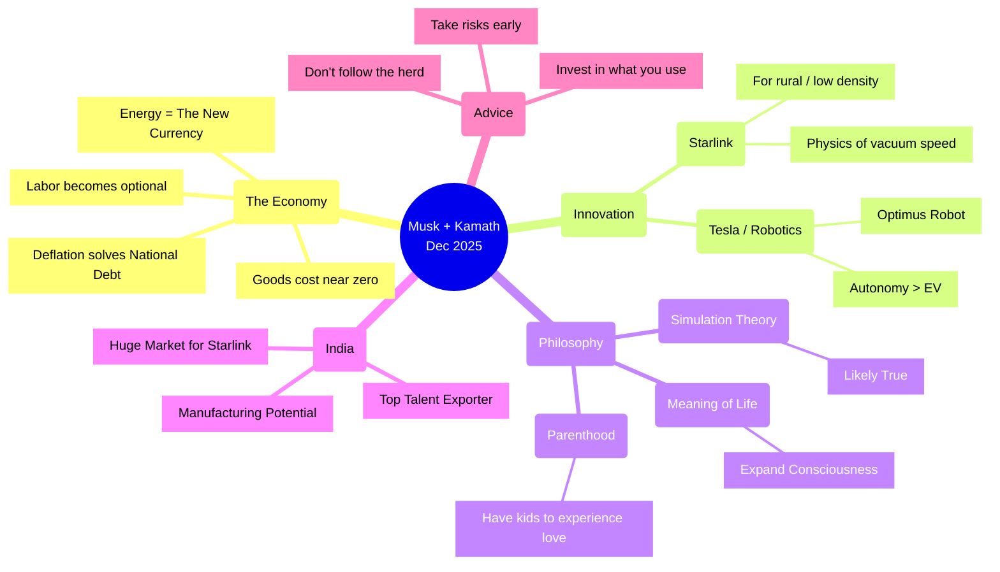

### The Economic Transition: From Labor to Energy

### Starlink in India: The Physics of Connectivity

### AI Safety: Truth vs. Programming

### Master Mindmap: Overview of the Conversation

Sources:

- [Elon Musk: A Different Conversation w/ Nikhil Kamath | Full Episode | People by WTF Ep. 16](https://www.youtube.com/watch?v=Rni7Fz7208c&t=369s)
