### Centralized Architecture (The App Model)

### Federated Architecture (The Email/Mastodon Model)

### P2P Architecture (The "Pure" Model)

### Nostr Architecture (The Relay Model)

```mermaid
graph TD
    %% Styles
    classDef clientA fill:#b9f6ca,stroke:#00c853,stroke-width:3px;
    classDef clientB fill:#80d8ff,stroke:#0091ea,stroke-width:3px;
    classDef relay fill:#eeeeee,stroke:#bdbdbd,stroke-width:2px,stroke-dasharray: 5 5;
    classDef sharedRelay fill:#fff59d,stroke:#fbc02d,stroke-width:4px;
    classDef key fill:#ffd54f,stroke:#ff8f00,stroke-width:1px,shape:rect;

    %% --- The Sovereign Clients ---
    subgraph Clients ["👥 The Sovereign Users"]
        direction LR
        
        subgraph UserASpace [User A Space]
            UserA((Alice)):::clientA
            KeyA[/"🔑 Key A"/]:::key
        end
        
        subgraph UserBSpace [User B Space]
            UserB((Bob)):::clientB
            KeyB[/"🔑 Key B"/]:::key
        end
    end

    %% --- The Dumb Infrastructure ---
    subgraph Cloud ["☁️ The Dumb Relay Cloud"]
        Relay1[(Relay 1)]:::relay
        
        %% THE MAGIC HAPPENS HERE
        Relay2[(Relay 2<br/>'The Meeting Point')]:::sharedRelay
        
        Relay3[(Relay 3)]:::relay
    end

    %% --- Connections (The Logic) ---
    
    %% Alice Writes to 1 & 2
    UserA -->|Publishes Event| Relay1
    UserA -->|Publishes Event| Relay2
    
    %% Bob Reads from 2 & 3
    Relay2 -.->|Subscribes/Pulls| UserB
    Relay3 -.->|Subscribes/Pulls| UserB

    %% Alice and Bob do NOT touch Relay 3 and 1 respectively
    UserA ~~~ Relay3
    Relay1 ~~~ UserB

    %% --- The Critical "Anti-Federation" Visual ---
    Relay1 -.-x|NO CONNECTION| Relay2
    Relay2 -.-x|NO CONNECTION| Relay3
    
    %% Insight
    Note[/"KEY INSIGHT:<br/>Communication happens because<br/>users overlap on Relay 2.<br/>The Relays don't talk!"/]:::invisible
    
    Relay2 --- Note

    classDef invisible fill:none,stroke:none;
```

### Summary

- **Centralized:** Identity is captive. All roads lead to one database; you serve the platform.
- **Federated:** Complexity kills. Servers must talk to servers (N^2), creating a maintenance nightmare that favors the big players.
- **P2P:** Physics interferes. Mobile devices are too weak to be servers, so the network naturally recentralizes around strong nodes.
- **Nostr:** Architecture is decoupled. Relays are "dumb pipes" that don't talk to each other; intelligence and control reside entirely with the user.

### Sources

- [Nature's many attempts to evolve a Nostr](https://newsletter.squishy.computer/p/natures-many-attempts-to-evolve-a)
