### Network Topology & Communication Model

```mermaid
flowchart TB
    subgraph GitHub_Cloud [☁️ GitHub Cloud Ecosystem]
        direction TB
        API["API Gateway<br/>api.github.com"]
        Git["Git Service<br/>github.com"]
        Storage["Blob Storage<br/>Raw Artifacts/Logs"]
        Queue[(Job Queue)]
    end

    subgraph Corporate_Network [🏢 Your Private Network]
        style Corporate_Network fill:#f0f8ff,stroke:#01579b
        
        subgraph Firewall [🛡️ Enterprise Firewall]
            direction TB
            Rule1[❌ BLOCK Inbound]
            Rule2[✅ ALLOW Outbound HTTPS]
        end

        Self_Runner["🖥️ Self-Hosted Runner<br/>(actions-runner agent)"]
        Internal_DB[(🔒 Internal DB/K8s)]
    end

    %% Connection Logic
    Self_Runner -- "1.Long Poll (443)" --> API
    API -- "2.Assign Job" --> Self_Runner
    
    %% The missing pieces in your original diagram
    Self_Runner -- "3.git pull" --> Git
    Self_Runner -- "4.Upload Logs/Artifacts" --> Storage
    Self_Runner -- "5.Download Runner Updates" --> Git
    
    %% Local execution
    Self_Runner -- "6.Test/Deploy" --> Internal_DB

    %% Styling to highlight the diverse connections
    linkStyle 0 stroke:#00cc00,stroke-width:2px;
    linkStyle 2 stroke:#blue,stroke-width:2px;
    linkStyle 3 stroke:#orange,stroke-width:2px;
    linkStyle 4 stroke:#purple,stroke-width:2px,stroke-dasharray: 5 5;
```

### Lifecycle & State Management: "Ephemeral vs. Persistent"

```mermaid
stateDiagram-v2
    direction TB

    state "GitHub-Hosted Runner" as GH {
        [*] --> ProvisionVM: Job Triggered
        ProvisionVM --> CleanEnv: 🕒 Spin up fresh VM (Slow)
        CleanEnv --> RunJob: Execute Steps
        RunJob --> DestroyVM: Job Finished
        DestroyVM --> [*]: 🗑️ Data Wiped Completely
    }

    state "Self-Hosted Runner (Default / Persistent)" as SH {
        state "Server Running" as Idle
        
        [*] --> Idle
        Idle --> Polling: Listen for Jobs
        Polling --> Execute: Job Received
        
        state Execute {
            DownloadCode --> InstallDeps: 🚀 Cached (Fast)
            InstallDeps --> RunScript
            RunScript --> PostRun: 🧹 Basic Cleanup (e.g. git credentials)
        }
        
        PostRun --> DirtyState: Job Finished
        DirtyState --> Idle: ⚠️ Files/Processes/Docker Containers Remain
        
        note right of DirtyState
            CRITICAL RISK:
            - Workspace (_work) persists
            - Global npm/pip packages persist
            - Background processes may leak
        end note
    }
```

### The Security Risk Model (The "Fork" Attack)

```mermaid
sequenceDiagram
    autonumber
    participant Hacker as 😈 Attacker
    participant PublicRepo as 📂 Public Repo
    participant Runner as 🖥️ Self-Hosted Runner
    participant Prod as 🏭 Production Server

    Hacker->>PublicRepo: Fork Repository
    Hacker->>Hacker: Modify workflow (Malicious)
    Hacker->>PublicRepo: Create Pull Request (PR)
    
    opt If "Require Approval" is OFF or bypassed
        PublicRepo->>Runner: ⚡ Trigger Workflow
    end
    
    rect rgb(255, 235, 235)
        note right of Runner: ⚠️ DANGER ZONE
        Runner->>Runner: Execute Malicious Script
        
        %% 关键改进点：区分 Repository Secret 和 Machine Credential
        Runner->>Runner: 🔍 Scan File System (Persistence Attack)
        note right of Runner: GitHub blocks repo secrets,<br/>BUT attacker reads ~/.aws, ~/.ssh, /var/run/docker.sock
        
        Runner->>Prod: 🔓 Lateral Movement using stolen SSH keys
        Runner-->>Hacker: 📤 Exfiltrate Server Root Password
    end
```

### The Modern Solution: Kubernetes (ARC)

```mermaid
flowchart LR
    subgraph K8s_Cluster [☸️ Your Kubernetes Cluster]
        direction TB
        
        subgraph ControlPlane [Control Plane]
            Controller["⚙️ ARC Controller<br/>(Manager)"]
            Listener["👂 Listener Pod<br/>(Auto-Scaling Runner Set)"]
        end
        
        subgraph Pods [ Ephemeral Runner Pod ]
            direction TB
            Agent[Runner Agent]
            DinD["🐳 Docker Daemon (Sidecar)"]
            Agent <--> DinD
        end
    end

    GitHub[☁️ GitHub] 

    %% 关键修正：Listener 主动建立连接，而不是被动接收 Webhook
    Listener -- "1.Long Poll / HTTPS Stream\n(Listening for Jobs)" --> GitHub
    GitHub -- "2.Signal: 'Scale Up!'" --> Listener
    
    Listener -- "3.Request Replicas" --> Controller
    Controller -- "4.Create Pod (JIT Config)" --> Agent
    
    Agent -- "5.Register & Run" --> GitHub
    Agent -- "6.Job Complete" --> Kill[💀 Pod Terminates]

    style DinD fill:#b3e5fc,stroke:#0277bd,stroke-dasharray: 5 5
    style Kill fill:#ffcccc,stroke:#ff0000
    style Listener fill:#e1bee7,stroke:#4a148c
```

### Sources

- [Self-hosted runners](https://docs.github.com/en/actions/concepts/runners/self-hosted-runners)
